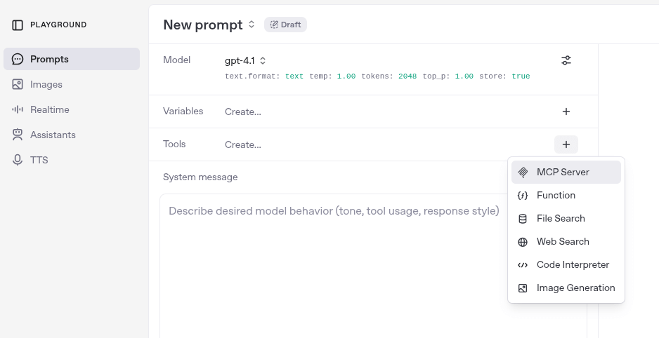
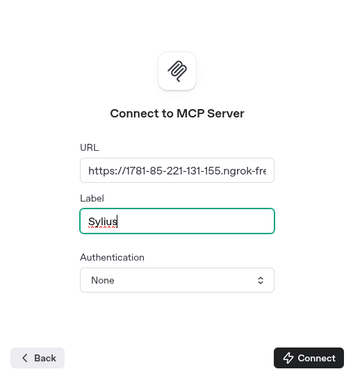

<p align="center">
    <a href="https://sylius.com" target="_blank">
        <picture>
          <source media="(prefers-color-scheme: dark)" srcset="https://media.sylius.com/sylius-logo-800-dark.png">
          <source media="(prefers-color-scheme: light)" srcset="https://media.sylius.com/sylius-logo-800.png">
          
        </picture>
    </a>
</p>

<h1 align="center">MCP Server Plugin</h1>

<p align="center"><a href="https://sylius.com/plugins/" target="_blank"></a></p>

<p align="center">
  A Sylius plugin that exposes a Model Context Protocol (MCP) server for enabling interaction with your store via
  Large Language Models (LLMs) like ChatGPT.
</p>

# Installation

## Requirements
We work on stable, supported and up-to-date versions of packages. We recommend you to do the same.

| Package       | Version |
|---------------|---------|
| PHP           | ^8.2    |
| sylius/sylius | ^2.1    |
| MySQL         | ^8.4    |
| NodeJS        | ^20.x   |

---
#### Beware!

This installation instruction assumes that you're using Symfony Flex.

1. Require plugin with composer:

  ```bash
    composer require sylius/mcp-server-plugin
  ```

**Clear application cache by using command:**

  ```bash
    bin/console cache:clear
  ```

---

## Documentation

### What is MCP Server?

The Model Context Protocol (MCP) is a standardized way to connect language models (like ChatGPT) with external tools,
APIs, and systems. It allows an AI model to make structured tool calls — similar to calling functions — during a conversation.

The MCP Server acts as a bridge between the language model and your application logic. It exposes a list of tools 
(like “search for a product” or “create an order”) and executes them in response to requests from the AI.

This plugin integrates Sylius with an MCP Server, enabling AI agents to interact with your store 
(e.g., search products, check prices, start checkout).

We use the official [php-mcp/server](https://github.com/php-mcp/server) package to provide the MCP server runtime.
```
┌────────────────┐                  ┌───────────────┐       ┌────────┐
│  MCP Client    │◄────────────────►│  MCP Server   │◄─────►│ Sylius │
│ (OpenAi, etc.) │ (Stdio/HTTP/SSE) │ (Tools, etc.) │ (API) │        │
└────────────────┘                  └───────────────┘       └────────┘
```

To learn more, see the official MCP introduction at [modelcontextprotocol.io](https://modelcontextprotocol.io/introduction).

### Running the MCP Server

You can run the server using the following command:

  ```bash
    bin/console sylius:mcp-server:start
  ```

By default, the server runs at: http://localhost:8080/mcp and it uses **Streamable HTTP Transport**.

### MCP Server Configuration

Create a file `config/packages/sylius_mcp_server.yaml` and customize it if needed.
Below is the default configuration:

```yaml
sylius_mcp_server:
  server:
    name:    'Sylius MCP Server'
    version: '0.1.0'
    transport:
      host: 127.0.0.1
      port: 8080
      prefix: 'mcp'
      enable_json_response: false
      ssl:
        enabled: false
        context: []

    session:
      driver: cache
      ttl: 3600

    discovery:
      locations:
        - { base_path: '%sylius_mcp_server.plugin_root%', scan_dirs: ['src/Tool'] }
```

You can enable SSL support by setting `ssl.enabled` to `true` and configuring the appropriate SSL context.
For details on how to configure the context, refer to the [SSL section in the php-mcp/server documentation](https://github.com/php-mcp/server?tab=readme-ov-file#ssl-context-configuration).

### Transport

By default, the server uses the Streamable HTTP Transport.
You may implement your own transport by creating a custom factory that implements `Sylius\McpServerPlugin\Factory\ServerTransportFactoryInterface`.
Then, override the transport in the McpServerCommand service definition.

### Sylius API 

Tools communicate with the Sylius API through pre-configured HTTP clients:

```yaml
sylius_mcp_server.http_client.api_shop:
    base_uri: '%sylius_mcp_server.api.shop_base_uri%'
    headers:
        - 'Accept: application/ld+json'
        - 'Content-Type: application/ld+json'
sylius_mcp_server.http_client.api_shop_merge_patch:
    base_uri: '%sylius_mcp_server.api.shop_base_uri%'
    headers:
        - 'Accept: application/ld+json'
        - 'Content-Type: application/merge-patch+json'
```

The default API base URI is http://localhost:8000/api/v2/shop/, and can be overridden using the environment variable `SYLIUS_MCP_SERVER_API_SHOP_BASE_URI`.

### Tools

The following tools are available out of the box:

| Name                    | Description                                                   |
|-------------------------|---------------------------------------------------------------|
| add_item_to_order       | Adds an item to the order.                                    |
| complete_checkout       | Completes the checkout process. (Final step)                  |
| create_order            | Creates a new order.                                          |
| fetch_channel           | Fetches a channel by code.                                    |
| fetch_currency          | Fetches a currency by code.                                   |
| fetch_order             | Fetches an order by its token.                                |
| fetch_product           | Fetches a product by its code.                                |
| fetch_product_variant   | Fetches a product variant by its code.                        |
| list_payment_methods    | Lists all available payment methods.                          |
| list_shipping_methods   | Lists all available shipping methods.                         |
| search_products         | Searches for products by name.                                |
| search_product_variants | Searches for product variants by name.                        |
| select_payment_method   | Selects a payment method for the order. (Step 3 of checkout)  |
| select_shipping_method  | Selects a shipping method for the order. (Step 2 of checkout) |
| update_order_address    | Updates the order address. (Step 1 of checkout)               |

These tools currently operate in guest mode only — `fetch_order` returns data only if the order has no associated customer account.

#### Adding custom tools

You can extend the server with your own tools by creating PHP classes annotated with attributes like **#[McpTool]**.
These tools will then be exposed to the MCP client just like the built-in ones.

To learn how to define and structure a tool, see the ["Defining MCP Elements" section of the php-mcp/server documentation](https://github.com/php-mcp/server?tab=readme-ov-file#-defining-mcp-elements).

Once your tool is ready, make sure the plugin is configured to discover it:
```yaml
sylius_mcp_server:
  server:
    discovery:
      locations:
        - { base_path: 'your_base_path', scan_dirs: ['your/custom/Tool/Directory'] }
```

### Usage Example

You can use the server directly in [OpenAI Playground](https://platform.openai.com/playground/prompts), exposing it via [ngrok](https://ngrok.com/) or similar tunneling tools.

#### Example with OpenAI Playground

1. Add a new tool in the OpenAI Playground.


2. Configure the tool with the following settings:
   - **URL**: `http://localhost:8080/mcp` (or your ngrok URL)
   - **Label**: Sylius
   - **Authentication**: None


#### Example with API Call

```bash
  curl https://api.openai.com/v1/responses \
    -H "Content-Type: application/json" \
    -H "Authorization: Bearer $OPENAI_API_KEY" \
    -d '{
      "model": "gpt-4.1",
  
      "tools": [
        {
          "type": "mcp",
          "server_label": "Sylius",
          "server_url": "$YOUR_MCP_SERVER_URL",
          "require_approval": "never"
        }
      ],
  
      "input": [
        {
          "role": "user",
          "content": [
            {
              "type": "input_text",
              "text": "Find me red shoes"
            }
          ]
        }
      ],
      "max_output_tokens": 1024
    }'
```

## Security issues

If you think that you have found a security issue, please do not use the issue tracker and do not post it publicly.
Instead, all security issues must be sent to `security@sylius.com`

## Community

For online communication, we invite you to chat with us & other users on [Sylius Slack](https://sylius-devs.slack.com/).

## License

This plugin's source code is completely free and released under the terms of the MIT license.
